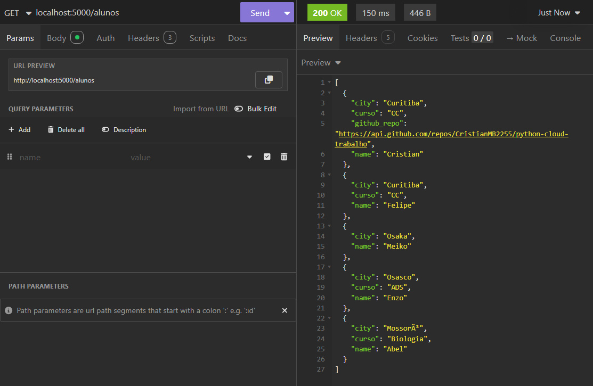
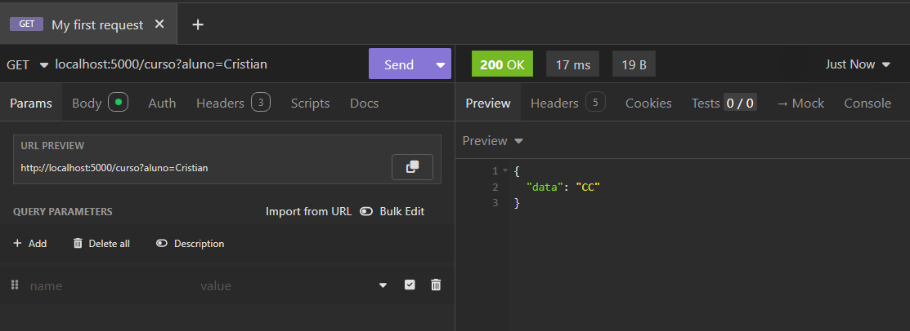
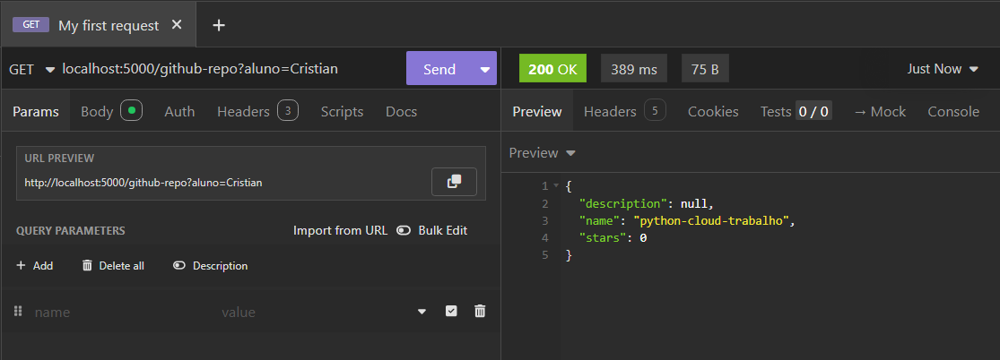
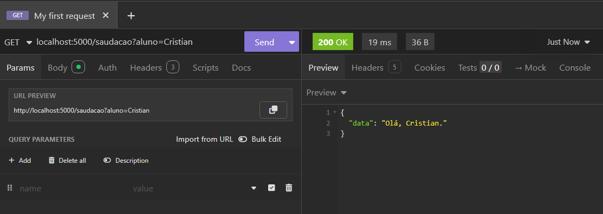
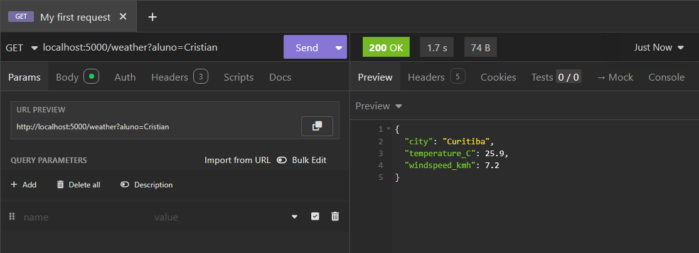

# API Simples em Flask

## 🎯 Objetivos de Aprendizagem

1. Consolidar o aprendizado de **Python** com **APIs**, **JSON** e **Flask**.  
2. Compreender a relação entre **Python** e **Cloud Computing**.  
3. Praticar **versionamento** com **Git e GitHub** (commit, push, pull).  
4. Desenvolver autonomia na **documentação de projetos**.

---

## 📌 Rotas da API

- **`alunos.py`**
  - `GET /alunos` → lista todos os alunos / lista alunos por nome 
  - `POST /alunos` → cria novos alunos  
  - `PUT /alunos/` → atualiza informações de alunos  
  - `DELETE /alunos/` → remove alunos

- **`curso.py`**
  - `GET /curso` → retorna o curso de uma aluno

- **`gitrepo.py`**
  - `GET /github-repo` → retorna informações do repositório do aluno(exemplo de integração com GitHub API)  

- **`saudacao.py`**
  - `GET /saudacao` → retorna uma mensagem de saudação simples para o aluno 

- **`weather.py`**
  - `GET /weather` → retorna dados de clima sobre a cidade do usuário

---

## Exemplos de uso para cada rota:
### GET rota alunos

### GET rota curso

### GET rota github-repo

### GET rota saudacao

### GET rota weather
